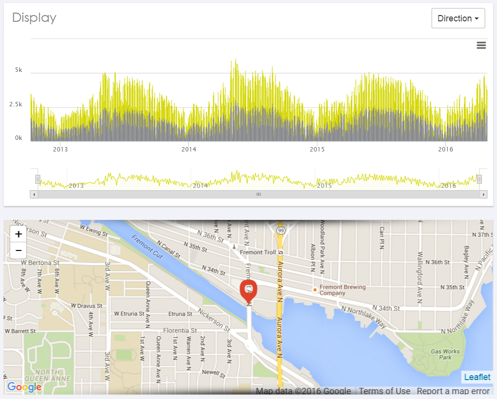
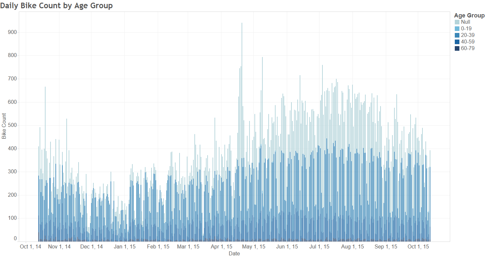
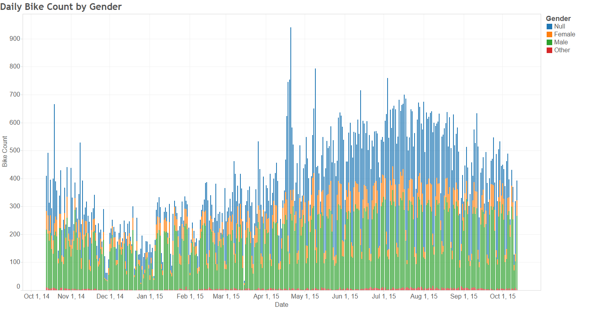
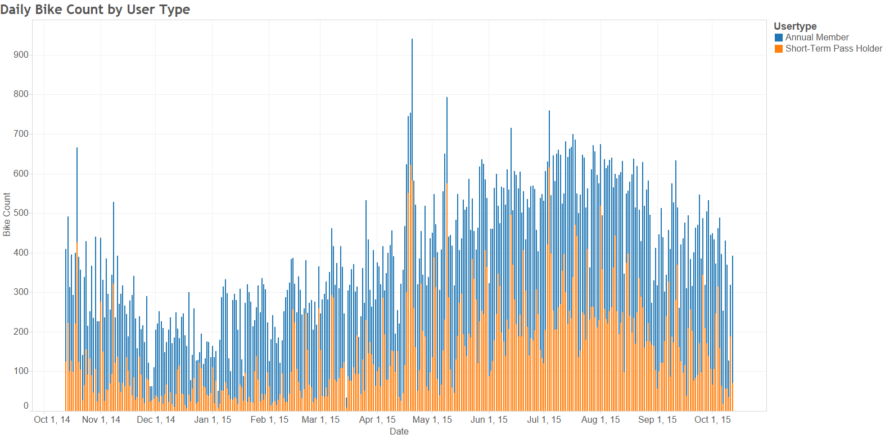
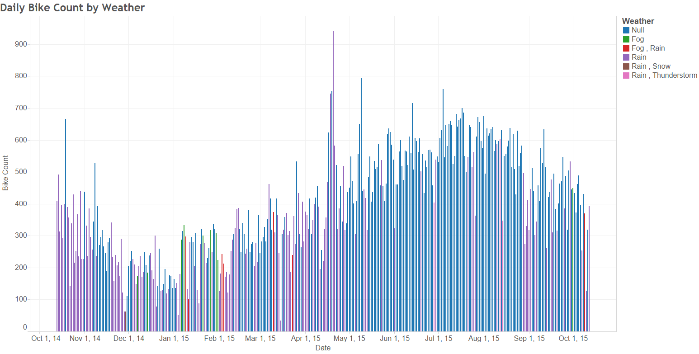
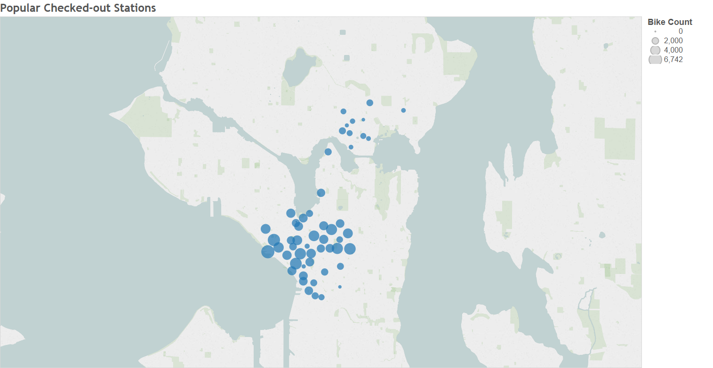
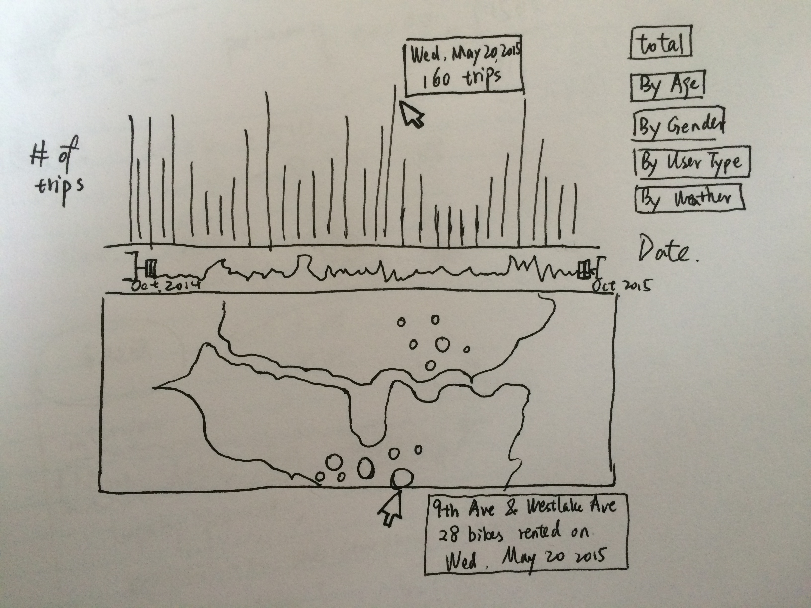
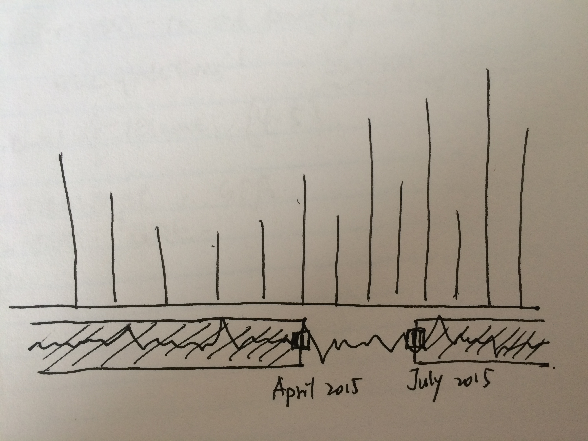

# Assignment 3 (a3-fidaalsughayer-wenhuy)

## Team Members
* Fida Al-Sughayer (fida)
* Alice (Wenhuan) Yang (wenhuy)

## Pronto Bike Ridership in 2015
Our data is publicly available from Pronto, which is the also the dataset for 2015 Pronto Data Challenge. This data contains various information from each individual trip to meteorology measurements of each single day. Some Examples are:
- Trip start date
- Starting station
- Birth year and gender of user
- Latitude and longitude of stations

## Running Instructions

## Story Board
Since May is the Bike Month of Seattle, we’d like to explore bike ridership throughout a year. We were mainly inspired by the visualization based on bike count data collected at Fremont Bridge and Spokane Street: 

We found it simple and yet informative and straightforward. The bar chart isn’t linked with the map below it. The interactive part is that you can slide the little grey box on the line chart to specify the period time you are interested in and the bar chart will zoom in and out as you wish. Also by putting your mouse on a bar, a text box will appear to show you the actual numbers on that specific date. 
We would also want these features in our project. In the Pronto’s trip data of 2015 we are using, there are lots of information regarding each individual trip, rider, weather, and etc. that we can utilize in our interactive plot. Here are some initial ideas we sketched in Tableau:
These three plots below are focusing on the rider aspects, i.e. rider’s age group, gender and membership type, for which we used color-encoding for distinguishing different categories.

We can also look at how weather affect Pronto bike ridership:

Another approach might be using geo-encoding to see the difference in popularity among different bike stations (this is the sum of all the bike counts available):

Our initial plan looked very similar to the Fremont one, whereas our map was linked to the bar chart and we have more features that could be displayed:

By selecting a different display in the upper right corner, the bar chart will be shown by different subgroups as indicated by the name. These options will look similar to the charts we sketched in Tableau above. When selecting a specific date, the map would show you the total bikes checked out at a specific location on the chosen date.

And when sliding the little boxes to the middle, the bar chart would zoom in to the chosen period of time.

### Changes between Storyboard and the Final Implementation

But because of the time constrain, we decided to do a simplified version of this interactive visualization.
We don't have the display options in the upper right corner and no interactive map.
Instead, we have two bar chart. The main bar chart is to show the total number of trips by date. The complementary chart is to show the duration of the trip.

## Development Process
Fida was responsible for the coding and implementing the design, Alice was responsible for the storyboard and write-up.
* about 2 hrs exploring and brainstorming possible datasets and ideas
* about 5 hrs on storyboard
* about 24+ on coding

Coding and debugging definitely took most of the time.
